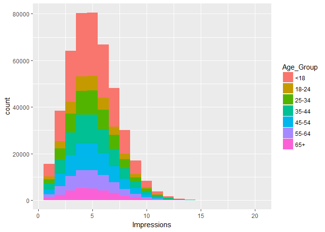
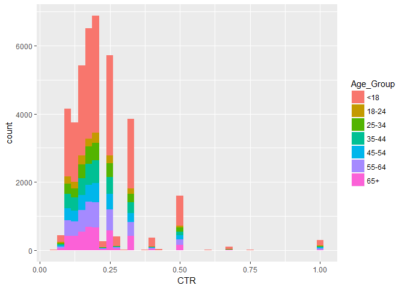
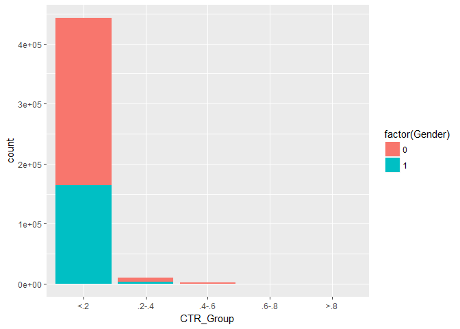
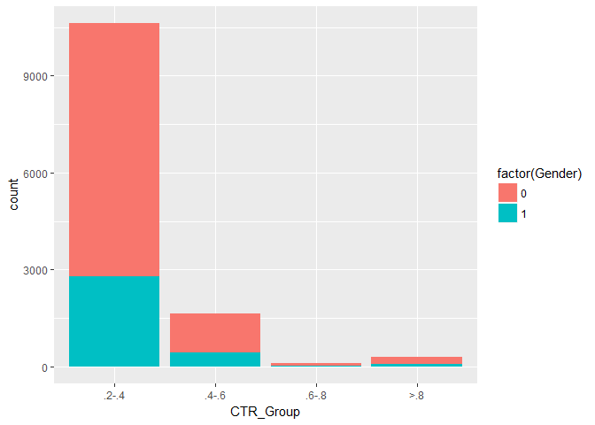
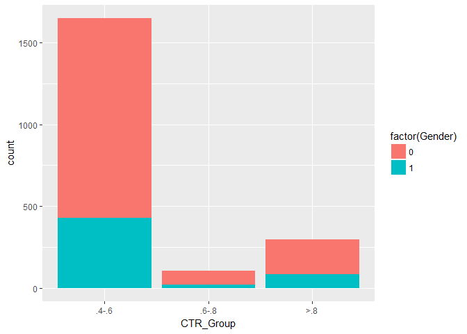
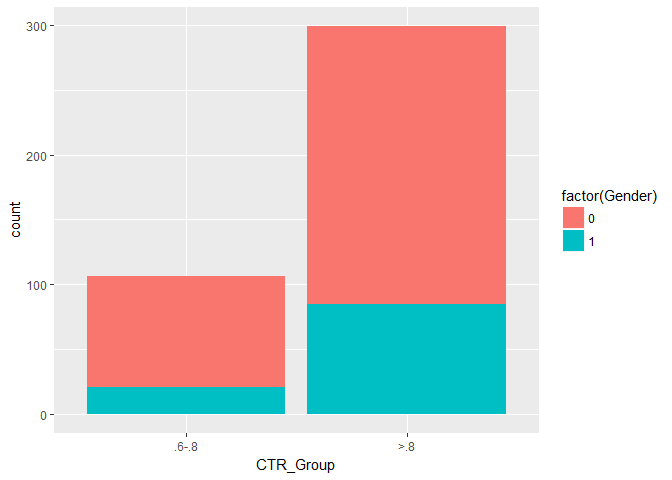

# DDS_HW10_EDA_in_R
Jack K. Rasmus-Vorrath  
July 20, 2017  

#The following EDA summarizes and visualizes factors of Click-Through-Rate data

##Q1: Data Import

```r
fileLocation <- "http://stat.columbia.edu/~rachel/datasets/nyt1.csv"
data1 <- read.csv(url(fileLocation))
head(data1)
```

```
##   Age Gender Impressions Clicks Signed_In
## 1  36      0           3      0         1
## 2  73      1           3      0         1
## 3  30      0           3      0         1
## 4  49      1           3      0         1
## 5  47      1          11      0         1
## 6  47      0          11      1         1
```

##Q2: Age Grouping

```r
data1$Age_Group <- cut(data1$Age, c(-Inf, 18, 24, 34, 44, 54, 64, Inf))
levels(data1$Age_Group) <- c("<18", "18-24", "25-34", "35-44", "45-54", "55-64", "65+")
head(data1)
```

```
##   Age Gender Impressions Clicks Signed_In Age_Group
## 1  36      0           3      0         1     35-44
## 2  73      1           3      0         1       65+
## 3  30      0           3      0         1     25-34
## 4  49      1           3      0         1     45-54
## 5  47      1          11      0         1     45-54
## 6  47      0          11      1         1     45-54
```

##Q3&4: Subset & Click-Through-Rate (CTR)

```r
d1 <-subset(data1, Impressions > 0)
d1$CTR <- d1$Clicks/d1$Impressions
head(d1)
```

```
##   Age Gender Impressions Clicks Signed_In Age_Group        CTR
## 1  36      0           3      0         1     35-44 0.00000000
## 2  73      1           3      0         1       65+ 0.00000000
## 3  30      0           3      0         1     25-34 0.00000000
## 4  49      1           3      0         1     45-54 0.00000000
## 5  47      1          11      0         1     45-54 0.00000000
## 6  47      0          11      1         1     45-54 0.09090909
```

##Q5: Impressions & CTR by Age_Group

```r
library(ggplot2)
ggplot(d1, aes(x = Impressions, fill = Age_Group)) + geom_histogram(binwidth = 1)
```

<!-- -->

```r
ggplot(subset(d1, CTR > 0), aes(x = CTR, fill = Age_Group)) + geom_histogram(binwidth = .025)
```

<!-- -->

##Q6: CTR Grouping

```r
d1$CTR_Group <- cut(d1$CTR, c(-Inf, .2, .4, .6, .8, Inf))
levels(d1$CTR_Group) <- c("<.2", ".2-.4", ".4-.6", ".6-.8", ">.8")
head(d1)
```

```
##   Age Gender Impressions Clicks Signed_In Age_Group        CTR CTR_Group
## 1  36      0           3      0         1     35-44 0.00000000       <.2
## 2  73      1           3      0         1       65+ 0.00000000       <.2
## 3  30      0           3      0         1     25-34 0.00000000       <.2
## 4  49      1           3      0         1     45-54 0.00000000       <.2
## 5  47      1          11      0         1     45-54 0.00000000       <.2
## 6  47      0          11      1         1     45-54 0.09090909       <.2
```

##Q7: Summary Totals

```r
#Male = 1, Female = 0
g <- sum(d1$Gender)
g
```

```
## [1] 167146
```

```r
sum(d1$Impressions)
```

```
## [1] 2295559
```

```r
sum(d1$Clicks)
```

```
## [1] 42449
```

```r
s <- sum(d1$Signed_In)
s
```

```
## [1] 319198
```

##Q8: Means & Percents

```r
mean(d1$Age)
```

```
## [1] 29.48401
```

```r
mean(d1$Impressions)
```

```
## [1] 5.04103
```

```r
mean(d1$Clicks)
```

```
## [1] 0.09321768
```

```r
mean(d1$CTR)
```

```
## [1] 0.01847053
```

```r
#Percent Male
l_gender <- length(d1$Gender)
pct_male <- g/l_gender
pct_male
```

```
## [1] 0.3670513
```

```r
#Percent Signed_In
l_signedin <- length(d1$Signed_In)
pct_signedin <- s/l_signedin
pct_signedin
```

```
## [1] 0.7009564
```

##Q9: Means & Percents by Age_Group

```r
#Means by Age_Group
library(doBy)
summary1 <- summaryBy(Impressions + Clicks + CTR ~ Age_Group, data = d1, FUN = mean)
summary1
```

```
##   Age_Group Impressions.mean Clicks.mean    CTR.mean
## 1       <18         5.033534  0.14167788 0.028141310
## 2     18-24         5.043240  0.04880905 0.009720481
## 3     25-34         5.026055  0.05081227 0.010146329
## 4     35-44         5.054749  0.05202148 0.010286330
## 5     45-54         5.045172  0.05062260 0.009957612
## 6     55-64         5.053484  0.10246952 0.020306816
## 7       65+         5.046925  0.15233226 0.029802702
```

```r
#Percents by Age_Group
percent <- function(x){percent = sum(x)/length(x)}
summary2 <- summaryBy(Gender + Signed_In ~ Age_Group, data = d1, FUN = percent)
summary2
```

```
##   Age_Group Gender.percent Signed_In.percent
## 1       <18      0.0790648         0.1231528
## 2     18-24      0.5339864         1.0000000
## 3     25-34      0.5319977         1.0000000
## 4     35-44      0.5317072         1.0000000
## 5     45-54      0.5292192         1.0000000
## 6     55-64      0.5359633         1.0000000
## 7       65+      0.3632512         1.0000000
```

##Q10: Counts of CTR_Group & Age_Group

```r
library(plyr)
ctr_age <- count(d1, c('CTR_Group', 'Age_Group'))
ctr_age
```

```
##    CTR_Group Age_Group   freq
## 1        <.2       <18 148412
## 2        <.2     18-24  34540
## 3        <.2     25-34  56980
## 4        <.2     35-44  69424
## 5        <.2     45-54  62936
## 6        <.2     55-64  43147
## 7        <.2       65+  27261
## 8      .2-.4       <18   5735
## 9      .2-.4     18-24    391
## 10     .2-.4     25-34    689
## 11     .2-.4     35-44    820
## 12     .2-.4     45-54    776
## 13     .2-.4     55-64   1104
## 14     .2-.4       65+   1108
## 15     .4-.6       <18    918
## 16     .4-.6     18-24     68
## 17     .4-.6     25-34    106
## 18     .4-.6     35-44    118
## 19     .4-.6     45-54    113
## 20     .4-.6     55-64    168
## 21     .4-.6       65+    156
## 22     .6-.8       <18     76
## 23     .6-.8     18-24      2
## 24     .6-.8     25-34      7
## 25     .6-.8     35-44      4
## 26     .6-.8     55-64      7
## 27     .6-.8       65+     10
## 28       >.8       <18    162
## 29       >.8     18-24     13
## 30       >.8     25-34     19
## 31       >.8     35-44     28
## 32       >.8     45-54     20
## 33       >.8     55-64     36
## 34       >.8       65+     21
```

##Q11&12: CTR_Group by Gender

```r
#All CTR_Groups
ggplot(d1, aes(x = CTR_Group, fill = factor(Gender)))+geom_bar()
```

<!-- -->

```r
#Excluding Lowest CTR_Group
ggplot(subset(d1, CTR_Group != "<.2"), 
       aes(x = CTR_Group, fill = factor(Gender)))+ geom_bar()
```

<!-- -->

```r
d2 <- subset(d1, CTR_Group != "<.2")
d3 <- subset(d2, CTR_Group != ".2-.4")
d4 <- subset(d3, CTR_Group != ".4-.6")

#Mid-to-High CTR_Groups by Gender
ggplot(d3, aes(x = CTR_Group, fill = factor(Gender)))+geom_bar()
```

<!-- -->

```r
ggplot(d4, aes(x = CTR_Group, fill = factor(Gender)))+geom_bar()
```

<!-- -->

```r
#Male-to-Female Ratio by CTR_Group
library(plyr)
ctr_gender <- count(d1, c('CTR_Group', 'Gender'))
m2f_CTR <- c(ctr_gender[2, 3]/ctr_gender[1, 3], ctr_gender[4, 3]/ctr_gender[3, 3], 
             ctr_gender[6, 3]/ctr_gender[5, 3], ctr_gender[8, 3]/ctr_gender[7, 3], 
             ctr_gender[10, 3]/ctr_gender[9, 3])
names(m2f_CTR) <- c("<.2", ".2-.4", ".4-.6", ".6-.8", ">.8")
m2f_CTR
```

```
##       <.2     .2-.4     .4-.6     .6-.8       >.8 
## 0.5874610 0.3554932 0.3500000 0.2470588 0.3971963
```
##Consistently more Females than Males click through, especially in the middle-to-high CTR categories.
